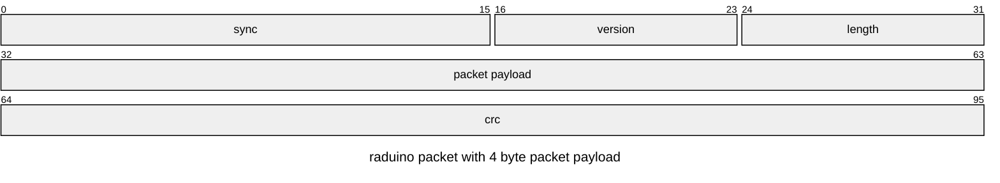
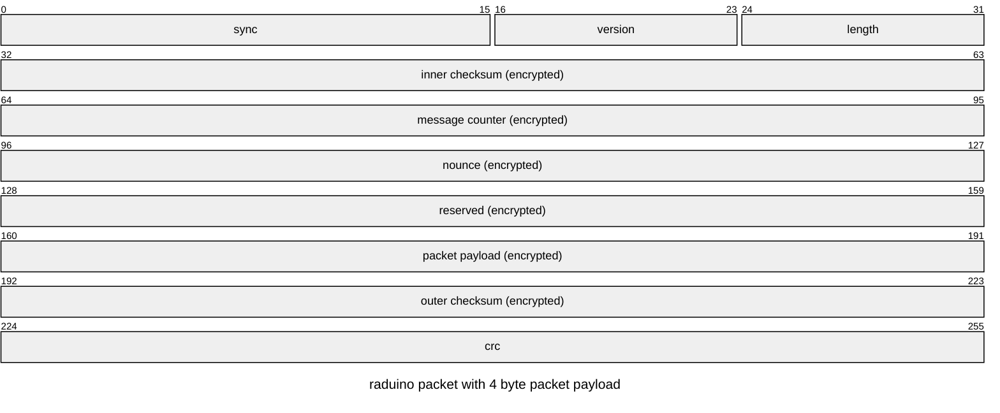
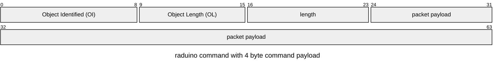
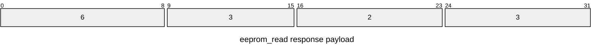

# binary protocol interface
   
## packet



## encrypted packet


byte 4-14 (first 16 byte, ie. 128 bit) is the IV for the CBC-CTS encryption algorithm.

## packet payload (command)



## protocol defines

The protocol defined in the file `interface/libs/protocol/include/protocolBase.hpp` is used by the arduino code and the linux code. This and other header files are part of the `raduino-interface` header only conan package.

`constexpr` is used to define constants organized in C++ namespace.

The following example of how to use these constants is taken from the file `interface/libs/protocol/include/streamProtocol.hpp`

```cpp
if (index == 1) {
    if (c != PROTOCOL::HEADER::SYNC_PATTERN_BYTE_1) {
        return 0;
    }
}
```

## cryptoHandlerInterface

The file `interface/libs/protocol/include/cryptoHandlerInterface.hpp` define the interface for the cryptoHandlerInterface. The implementation is done in the arduino and linux source folders.

## example command

## eeprom_read

### command payload


binary: 06 02 00 02

### response payload



binary: 06 03 00 02 03

## display binary data using the verbose flag

example using the ping command `./bin/raduino-gateway -Vp`

This is a command with no command payload and thus the size of the protocol packet is the minimum size of 10 bytes.

```console
w: FE ED 01 02 21 00 F2 BA F7 FA 
r: FE ED 01 02 21 00 F2 BA F7 FA 
[2566]complete : PING                   :
```

sync: FE ED
protocol version: 01
protocol payload length: 02
OI: 21
OL: 00
Checksum: F2 BA F7 FA

## example of encrypted command

ping command without encryption. If you have studied the matrix long enough you can see a pattern.

```console
lars@lionfish:~/priv/radio-arduino$ ./bin/raduino-gateway -Vp
w: FE ED 01 02 21 00 F2 BA F7 FA 
r: FE ED 01 02 21 00 F2 BA F7 FA 
[2882]complete : PING                   : 
```

ping command with encryption. The protocol payload is enctypted using AES128 CBC-CTS.

```console
lars@lionfish:~/priv/radio-arduino$ ./bin/raduino-gateway -VTp
w: FE ED 02 16 83 93 4B DB 61 3D F8 27 54 93 46 FC 0F 18 26 0A 94 2A 52 5B 26 99 F2 27 58 EC 
r: FE ED 02 16 F9 9C 96 90 54 4B 96 15 90 96 BB C8 6C F9 E4 4B 58 62 DB C0 0A 92 3F 46 A5 B1 
[48102]complete : PING                   :
```

### Performance on AVR

* Response time increased from 2.882 ms to 58.102 ms. The added time of 45.220 ms is mostly due to the 4 AES block operations which take around 11.3 ms each.

be gentle with me. I am not a crypto expert.

