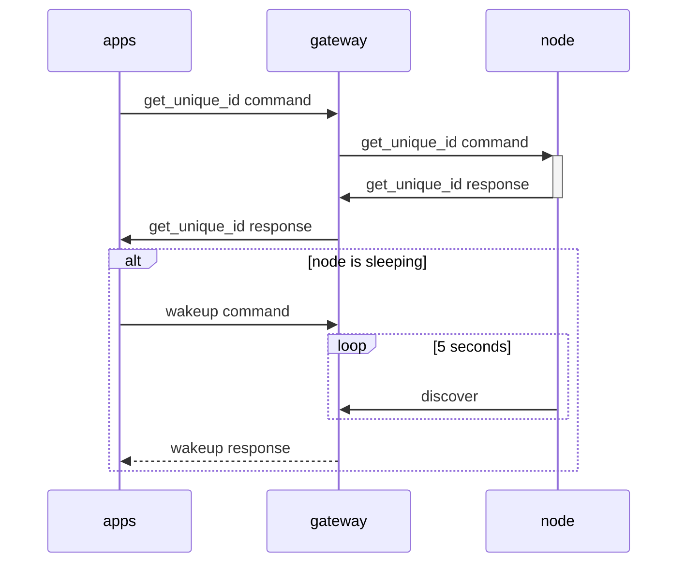

# wakeup

## wakup of a sleeping node using wakeup command

The diagram below shows how the [radioSession](../../../linux/libs/radiosession/radioSession.cpp)
class wake up a sleeping node.

> Note that the node sends a discover message every 5 seconds so it is really
waking itself up.



## example

Communication capture during wakeup of radio node with command
`./bin/raduino-system-commands --device myserial -N 0 -P`.

### commands
- set_node_address, 0 (OK)
- ping node (timeout)
- wakeup (OK)
- ping timeout (OK)

### communication with gateway

capture serial communication using [socat](../../how-to-guides/how-to-monitor-serial-trafic-using-socat.md)

> Note that this capture is from version 1 of the wakeup protocol.
> TODO: Update capture

```console
< 2025/11/11 22:39:25.000931462  length=11 from=0 to=10
 fe ed 01 03 1f 01 00 c4 5d 2a 01                 ........]*.
--
> 2025/11/11 22:39:25.000935198  length=10 from=0 to=9
 fe ed 01 02 1f 00 ad d6 a6 3b                    .........;
--
< 2025/11/11 22:39:25.000936236  length=10 from=11 to=20
 fe ed 05 02 21 00 f2 ba f7 fa                    ....!.....
--
< 2025/11/11 22:39:26.000436519  length=11 from=21 to=31
 fe ed 01 03 1e 01 00 c5 85 86 86                 ...........
--
> 2025/11/11 22:39:28.000005368  length=11 from=10 to=20
 fe ed 01 03 1e 01 01 c1 44 9b 31                 ........D.1
--
< 2025/11/11 22:39:28.000006010  length=10 from=32 to=41
 fe ed 05 02 21 00 f2 ba f7 fa                    ....!.....
--
> 2025/11/11 22:39:28.000012684  length=10 from=21 to=30
 fe ed 05 02 21 00 f2 ba f7 fa                    ....!.....
--
```

