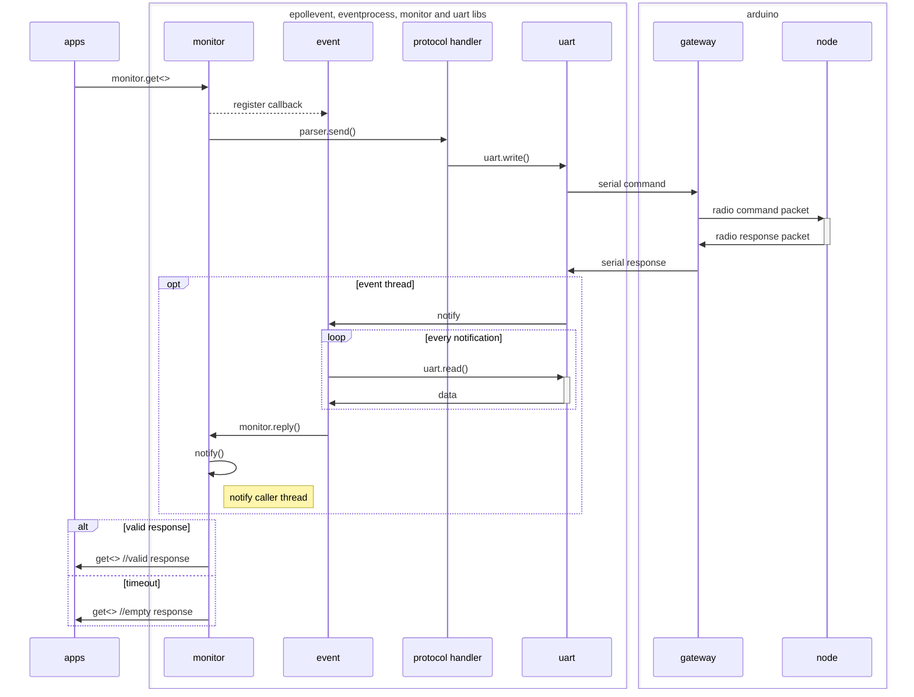

# linux uart monitor

The monitor `linux/libs/monitor/monitor.cpp` and `linux/libs/uart/uart.cpp` are responsible for asyncronous sending and receiving of data over the serial port. The `linux/libs/epollevent/epollevent.cpp` is responsible for calling the correct callback when data has been received in the readerThread.

> how `mon.getRadio<>(RaduinoCommandPing())` is able to return an object of class `RaduinoCommandPing` even if there is no reponse.

1. monitor is initialized with a protocol handler
1. monitor.get<> is called from application with a command object
1. monitor registers callback in eventprocess
1. monitor sends the commadn to the protocol handler
1. protocol handler write to the serial port
   - uart write to gateway arduino
   - gateway arduino creates and sends a radio packet
   - node responds with a radio packet
   - gateway sends response to the serial port
1. serial port read cause an epollevent in Linux which notifies the event thread
1. the event thread reads data from uart
1. the event thread sends data to the monitor class in the event thread
1. when enough data is received in the event thread or a timeout has occured the caller thread is called
1. the monitor will either return a valid response object or an empty response object of the same type as the command object

