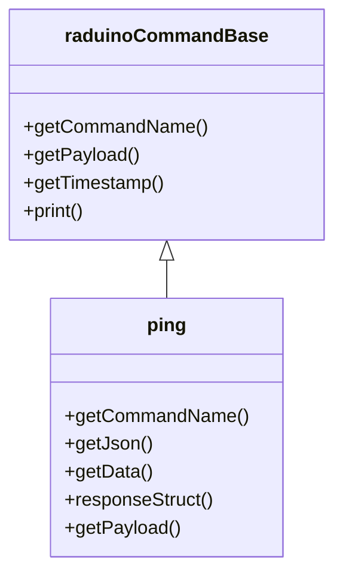

# generated command classes

```mermaid
classDiagram
    raduinoCommandBase <|-- ping
    raduinoCommandBase: +getCommandName()
    raduinoCommandBase: +getPayload()
    raduinoCommandBase: +getTimestamp()
    raduinoCommandBase: +print()
    class ping{
      +getCommandName()
      +getJson()
      +getData()
      +responseStruct()
      +getPayload()
    }
```

