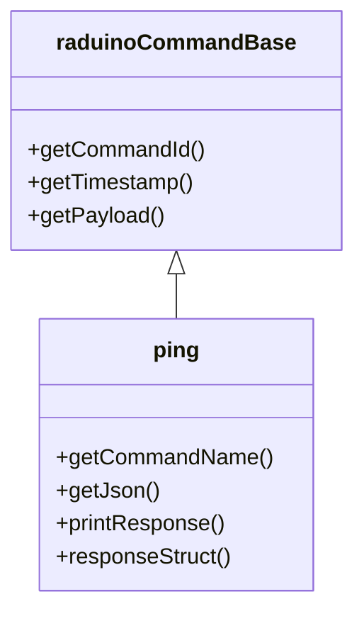

# generated command classes

```mermaid
classDiagram
    raduinoCommandBase <|-- ping
    raduinoCommandBase: +getCommandId()
    raduinoCommandBase: +getTimestamp()
    raduinoCommandBase: +getPayload()
    class ping{
      +getCommandName()
      +getJson()
      +printResponse()
      +responseStruct()
    }
```

